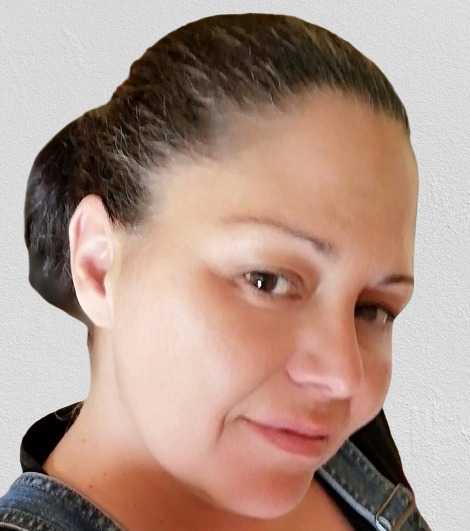

# Elsa da Silveira

*You Learn More From Failure Than From Success. Don’t Let It Stop You. Failure Builds Character.* – Unknown 

---

---
## Versatile with an ability to adapt to any situation

 |Header 1  |  Header 2 |
 |:---------: | :------------: |
  | Birthday| 20/01|
 |Gender | Female|
 |Favorite color | Black|
 |Favorite food | Steak|
 |Pinneapple on pizza | -[ ]Yes -[x]No |

---
## Hobbies 
 
 + Reading
 + Tv series
 + Movies
   - sci-fi
   - suspense
   - fantasy
 + coloring

---
## You can always count on me when
 
 I'll always try to help you as much as i can, giving you tips or by just being there for moral support.

---
## A funny story 
 
 When i was working for Ryanair, i was with a friend of mine also portuguese, at the departures hall in Charleroi getting lunch, and we heard a little girl talking in a really weird language. I look at my friend and say in portuguese 'what a weird language she is talking. How can kids learn weird languages?' 
 The kids mother heard us and replied in portuguese ' it's a weird language, isn't it? It's luxembourgish....'
 Lesson of the story always be careful with what you say.

---
## TL;DR 
 
 Always be careful with what you say.

The links should have the following structure:

<< previous || da SILVEIRA || next >>
